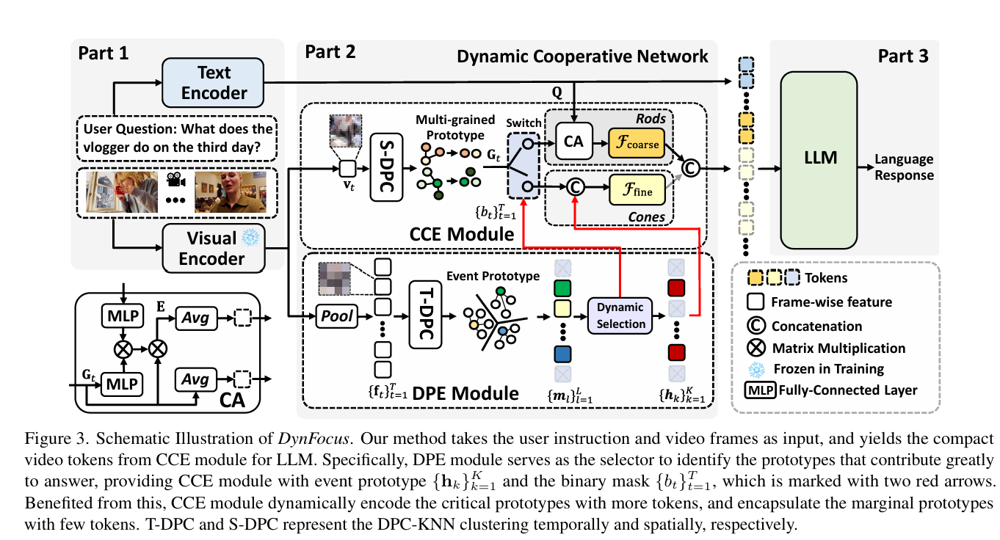

# DynFocus: Dynamic Cooperative Network Empowers LLMs with Video Understanding

Official implementation of **DynFocus: Dynamic Cooperative Network Empowers LLMs with Video Understanding**

Resources: [📑 <a href="https://arxiv.org/abs/2411.12355">Paper (Arxiv)</a>]

## News

- [2025/2/18] <a href="https://arxiv.org/abs/2411.12355">Paper</a> is now available on arxiv.

## Method



- **Dynamic Event Prototype Estimation (DPE)**: DPE serves as the dynamic selector to accurately discern the meaningful frames, which takes both
 redundancy and correspondence to question answering into consideration as the selection standard. 
- **Compact Cooperative Encoding (CCE)**: Afterwards, CCE complies with the dynamic encoding principle. The meaningful frames are encoded with fine-grained context features for detailed visual appearance, whereas those redundant frames are substantially encapsulated into a few tokens for sketchy perception, which enables LLM to capture broader temporal clues within a fixed receptive field.


## Todo

- [&#10004;] Release Paper
- [] Release Code
- [] Release Checkpoints

## Citation

If you find this paper helpful, you can cite the following paper:

```bibtex
@article{DBLP:journals/corr/abs-2411-12355,
  author       = {Yudong Han and
                  Qingpei Guo and
                  Liyuan Pan and
                  Liu Liu and
                  Yu Guan and
                  Ming Yang},
  title        = {DynFocus: Dynamic Cooperative Network Empowers LLMs with Video Understanding},
  journal      = {CoRR},
  volume       = {abs/2411.12355},
  year         = {2024},
  url          = {https://doi.org/10.48550/arXiv.2411.12355},
}
```
